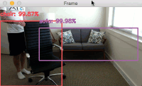

# Human Body and Face Recognition
#### Project Status: [Under development]

<p align="center">
  
</p>

## Discription
Our project aims to implement real-time object detection using the YOLO (You Only Look Once) algorithm. YOLO is a state-of-the-art deep learning model known for its speed and accuracy in detecting objects in images and videos. Unlike traditional object detection methods that rely on sliding window approaches or region proposal networks, YOLO frames object detection as a single regression problem, making it significantly faster.

## Key Features:

#### Real-Time Detection: 
Utilizing the efficiency of YOLO, our system can detect objects in real-time, enabling applications such as surveillance, autonomous driving, and robotics.

#### High Accuracy: 
Despite its speed, YOLO maintains high accuracy in detecting objects of various classes, sizes, and orientations.

#### Customizable: 
The project allows users to train custom object detection models using their own datasets, enabling applications tailored to specific domains or use cases.

#### Integration: 
We provide integration with popular deep learning frameworks such as TensorFlow and PyTorch, making it easy for developers to deploy and integrate our object detection system into their projects.

## Potential Applications:

#### Surveillance Systems: 
Monitoring and detecting objects of interest in surveillance camera feeds for security purposes.
#### Autonomous Vehicles: 
Object detection plays a crucial role in enabling autonomous vehicles to perceive and respond to their environment.
#### Retail Analytics: 
Tracking customer behavior and product interactions for retail analytics and inventory management.
#### Industrial Automation: 
Detecting defects or anomalies in manufacturing processes for quality control and automation.

## Technologies Used:

#### YOLO Algorithm: 
Leveraging the YOLO algorithm for efficient object detection.
#### Deep Learning Frameworks: 
TensorFlow, PyTorch, or other frameworks for training and deploying the models.
#### Computer Vision Libraries: 
OpenCV for image processing and visualization.


## How to run project
1. Install the requirements.txt
```python
pip install -r requirements.txt
```
2. Start using project
```python
python3 main.py
```


## Author
~~~
Dr. Mohan M. Kshirsagar
DIY Robotics India
mohan.kshirsagar@diyrobotics.in
~~~

